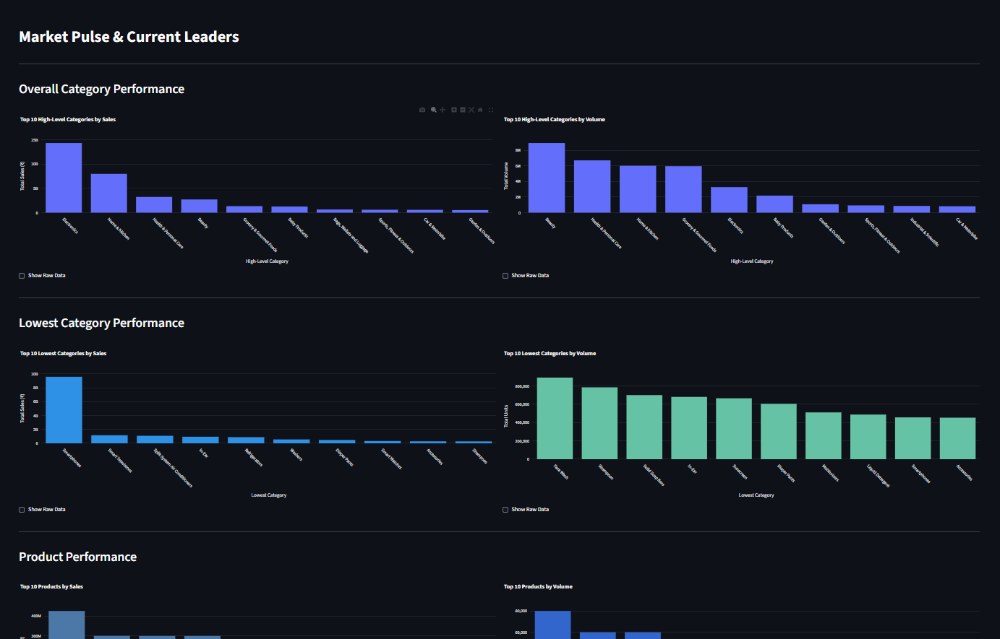
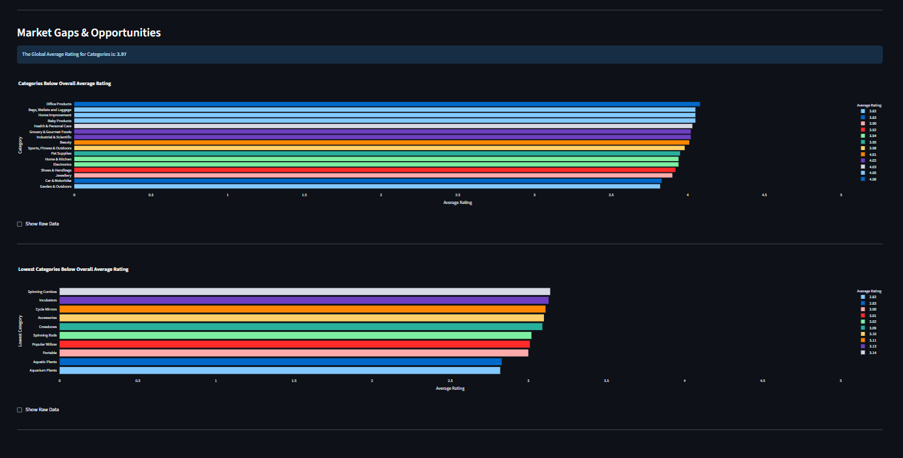

# E-commerce Analytics Dashboard


An interactive web dashboard built with Streamlit to visualize and analyze e-commerce data from a PostgreSQL database. This dashboard provides key insights into sales trends, customer behavior, and product performance.

-----

## 🚀 Features

  * **Sales Overview:** Real-time tracking of total revenue, number of orders, and average order value.
  * **Time-Series Analysis:** Interactive charts to explore sales performance over daily, weekly, and monthly periods.
  * **Customer Insights:** Analysis of customer demographics and purchasing patterns.
  * **Product Performance:** Identification of top-selling products and categories.
  * **Data Filtering:** Ability to filter the entire dashboard by date range, product category, and other dimensions.

-----

## 🛠️ Prerequisites

Before you begin, ensure you have the following installed on your system:

  * **Python 3.8+**
  * **PostgreSQL:** An active and running instance of PostgreSQL.
  * Your e-commerce data should already be loaded into a PostgreSQL database.
  * You can use either **Conda** or a standard **Python virtual environment (`venv`)** to set up the project.

-----

## ⚙️ Getting Started

Follow these steps to get your local development environment set up and running.

### 1\. Clone the Repository

```bash
git clone https://github.com/Yash138/e-commerce.git
cd e-commerce/Amazon_Dashboard
```

### 2\. Create and Activate the Environment

You have two options for creating the virtual environment. Choose the one that suits your workflow.

\<details\>
\<summary\>\<strong\>🔵 Option A: Using Conda (Recommended)\</strong\>\</summary\>

1.  **Create the Conda environment** using the `environment.yml` file. This will install all necessary packages.

    ```bash
    conda env create -f environment.yml
    ```

2.  **Activate the new environment.** The environment name is specified inside the `environment.yml` file (e.g., `ecomm_dashboard`).

    ```bash
    conda activate ecomm_dashboard
    ```

\</details\>

\<details\>
\<summary\>\<strong\>🐍 Option B: Using Python `venv`\</strong\>\</summary\>

1.  **Create a Python virtual environment.**

    ```bash
    python -m venv venv
    ```

2.  **Activate the environment.**

      * On **macOS/Linux**:
        ```bash
        source venv/bin/activate
        ```
      * On **Windows**:
        ```bash
        venv\Scripts\activate
        ```

3.  **Install the required packages** using `pip`.

    ```bash
    pip install -r requirements.txt
    ```

\</details\>

### 3\. Configure Database Credentials

The application connects to your PostgreSQL database using credentials stored in an environment file.

1.  In the root of the project, create a new file named `.env.local`. You can do this by copying the example file if one is provided:

    ```bash
    # cp .env.example .env.local
    ```

2.  Open the `.env.local` file and update it with your specific PostgreSQL credentials:

    ```ini
    # .env.local
    DB_HOST=localhost
    DB_PORT=5432
    DB_NAME=your_database_name
    DB_USER=your_postgres_username
    DB_PASSWORD=your_secret_password
    ```

⚠️ **Important:** The `.env.local` file contains sensitive information. It is included in the `.gitignore` file to prevent it from being committed to version control. **Never share this file or commit it to Git.**

-----

## ▶️ Running the Dashboard

Once your environment is activated and you have configured your database credentials, you can launch the Streamlit application.

1.  Make sure you are in the root directory of the project.

2.  Run the following command in your terminal:

    ```bash
    streamlit run dashboard.py
    ```

The application will automatically open in a new tab in your default web browser.

-----

## Project Structure

```
.
├── .env.local              # Local environment variables (created by you)
├── .gitignore              # Files to be ignored by Git
├── dashboard.py            # Main Streamlit application script
├── config.py               # Configuration loader for environment variables
├── environment.yml         # Conda environment definition
├── requirements.txt        # Python package requirements for venv
└── README.md               # This file
```